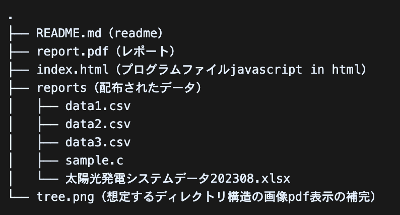

# K-means法 クラスタリング 人工知能とデータマイニング

2023/11/16

## 問題

``` 

添付資料を展開すると，以下の5つのファイルが得られる．
1. 太陽光発電システムデータ202308.xlsx
2号館屋上に設置されている太陽光発電システムの2023年8月に関するデータ．各列の説明を以下に記す．
A: データ番号
B: 年月日
C: 曜日
D: 時刻（この行のデータはこの時刻から1時間のデータ）
E～H: 太陽光発電システムで測定された実発電量，日射量，気温，消費電力量
I～L: E～Hのデータを上限値が1になるように変換したデータ
M～P: E～Hのデータを下限値が0，上限値が1になるように変換したデータ
Q: 特記すべきイベント

2. data1.csv
1のファイルの列E～Hのデータ

3. data2.csv
1のファイルの列I～Lのデータ

4. data3.csv
1のファイルの列M～Pのデータ

5. sample.c
データの読込みに関してC言語で書かれたプログラム

18時間×31日分の実発電量，日射量，気温，消費電力量をクラスタリングするプログラムを作成し，実行した結果をもとに考察せよ．
・クラスタリングの手法はk-means法もしくはk-medoid法を用いること．
・使用するプログラミング言語は何でもよい（sample.cの使用は任意）．
・kの値はいくつに設定してもよい．
・data1.csv，data2.csv，data3.csvのいずれを用いてもよい．
・クラスタリングの結果の示し方やレポートの枚数に制限はないが，簡潔にわかりやすくまとめること．
・レポートの冒頭に「太陽光発電と消費電力に関するレポート」と書き，次の行に学籍番号と氏名を書いて，続きは以下の構成で書くこと．
　1. クラスタリング結果（クラスタリングの手法，kの値，使用したデータの説明も含む）
　2. 考察
　3. プログラムソース

```

## 内容

* レポート
* [プログラムソース（Javascript in html）](https://github.com/ManatoYamashita/Kmeans-clustering-aiAssignment)

### 想定しているディレクトリ構造

.
├── README.md（readme）
├── report.pdf（レポート）
├── index.html（プログラムファイルjavascript in html）
├── reports（配布されたデータ）
│   ├── data1.csv
│   ├── data2.csv
│   ├── data3.csv
│   ├── sample.c
│   └── 太陽光発電システムデータ202308.xlsx
└── tree.png（想定するディレクトリ構造の画像pdf表示の補完）



（リポジトリには.htmlと.pdfと.mdファイルのみ）

## 太陽光発電と消費電力に関するレポート

> 学籍番号: 2172117
> 氏名: 山下

### 1. クラスタリング結果

* 本レポートでは，東京都市大学横浜キャンパス2号館屋上に設置されている太陽光発電システムの2023年8月に関するデータを用いて,

1. 実発電量
2. 日射量
3. 気温
4. 消費電力量

の4つの変数について，**k-means法**でクラスタリングを行った. k-means法は，データをk個のクラスタに分ける手法で，各クラスタの重心とデータの距離の総和を最小化するように，反復的に重心とクラスタの割り当てを更新する.
**本レポートでは，kの値を2とした．**

使用したデータは，太陽光発電システムデータ202308.xlsxのE～H列，I～L列，M～P列をそれぞれdata1.csv，data2.csv，data3.csvとして保存したものである．
E～H列は，実発電量，日射量，気温，消費電力量の実測値である．I～L列は，E～H列のデータを上限値が1になるように変換したものである．M～P列は，E～H列のデータを下限値が0，上限値が1になるように変換したものである．

* クラスタリングの結果は，以下の表に示すとおりである．

    | データ | 重心1 | 重心2 |
    | --- | --- | --- |
    | 実発電量1 | 22.09, 665.62, 30.18, 349.33 | 1.94, 78.03, 27.87, 161.74 |
    | 実発電量2 | 0.57, 0.74, 0.92, 0.58 | 0.05, 0.11, 0.85, 0.28 |
    | 実発電量3 | 0.56, 0.74, 0.72, 0.51 | 0.05, 0.10, 0.48, 0.12 |
    | 日射量1 | 22.09, 665.62, 30.18, 349.33 | 1.94, 78.03, 27.87, 161.74 |
    | 日射量2 | 0.57, 0.74, 0.92, 0.58 | 0.05, 0.11, 0.85, 0.28 |
    | 日射量3 | 0.56, 0.74, 0.72, 0.51 | 0.05, 0.10, 0.48, 0.12 |
    | 気温1 | 1.94, 78.03, 27.87, 161.74 | 22.09, 665.62, 30.18, 349.33 |
    | 気温2 | 0.05, 0.11, 0.85, 0.28 | 0.57, 0.74, 0.92, 0.58 |
    | 気温3 | 0.05, 0.10, 0.48, 0.12 | 0.56, 0.74, 0.72, 0.51 |
    | 消費電力量1 | 22.09, 665.62, 30.18, 349.33 | 1.94, 78.03, 27.87, 161.74 |
    | 消費電力量2 | 0.05, 0.11, 0.85, 0.28 | 0.57, 0.74, 0.92, 0.58 |
    | 消費電力量3 | 0.05, 0.10, 0.48, 0.12 | 0.56, 0.74, 0.72, 0.51 |

### 2. 考察

* 実発電量と日射量は，ほぼ同じようにクラスタリングされている．これは，実発電量が日射量に比例することを示している．
* 気温は，実発電量と日射量とは逆にクラスタリングされている．これは，気温が高いときは，実発電量と日射量が低くなることを示している．これは，太陽光発電システムの効率が気温に影響されることや，気温が高いときは雲が多くなることなどが原因と考えられる．
* 消費電力量は，実発電量と日射量と同じようにクラスタリングされているが，重心の値が異なる．これは，消費電力量が実発電量と日射量に比例しないことを示している．これは，消費電力量が他の要因にも影響されることや，太陽光発電システムの発電量が消費電力量を満たさないことなどが原因と考えられる．
* クラスタ1は，実発電量と日射量が高く，気温が低く，消費電力量が中程度のデータで構成されている．これは，晴れた日や朝夕などの時間帯に相当すると考えられる．
* クラスタ2は，実発電量と日射量が低く，気温が高く，消費電力量が低いデータで構成されている．これは，曇りや雨の日や昼間などの時間帯に相当すると考えられる.